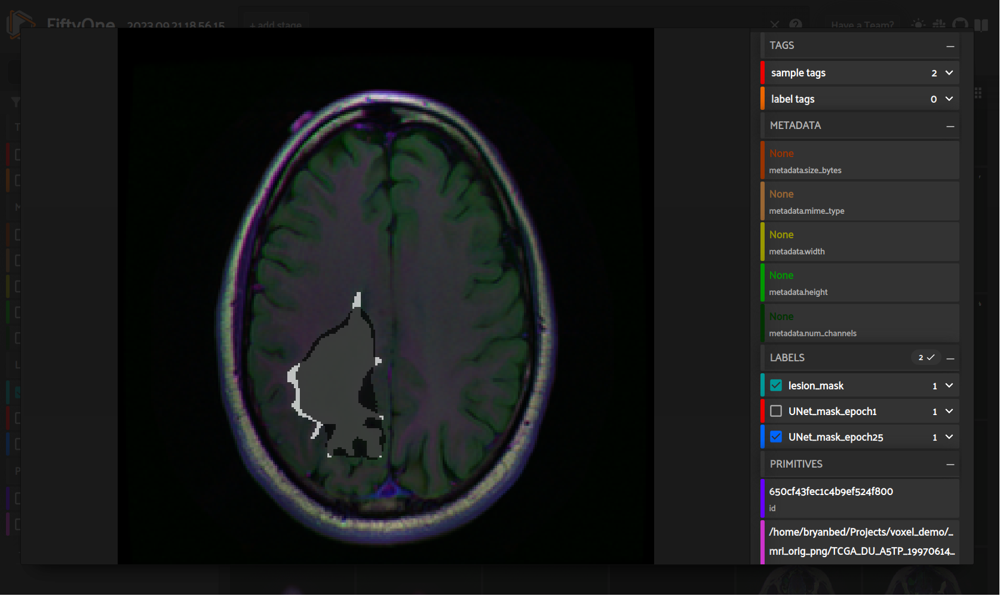
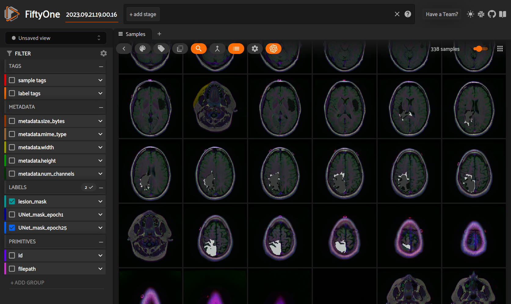

# FiftyOne_UNet_FLAIR
Use of FiftyOne to improve FLAIR brain MRI data processing and training of a 2D-UNet segmentation network (PyTorch)

# Goal: Step-by-step AI Optimization for Brain Lesion Segmentation with FiftyOne, PyTorch, and a 2D UNet model

## Motivation

Medical imaging is a huge application space for computer vision and AI. The U.S. medical industry is over 17% of national GDP. With the average age of cancer screenings moving up, it's important to facilitate the rapid development of medical CV by allowing practitioners to robustly curate datasets, annotations, and develop models directly on top of the data platform. FiftyOne is well-positioned to become an irreplacable tool in the model development pipeline. However, medical imaging also offers a unique set of challenges such as unique file types, 3D volumetric data, and unique image metadata per application. Additionally, medical imaging tasks are frequently comprised of "non-natural" images, which may not facilitate acceptable performance from pretrained foundational imaging models. 

In this notebook, I demo'd using FiftyOne as a core tool in developing a brain tumor segmentation model from mri. I worked around incompatibilites encountered with the .tif database, visualize the dataset in FiftyOne to inform the development of the subsequent Torch dataloader, and visually confirmed improving segmentation performance of my model in FiftyOne. 

## Methods
Models: 2D UNet implemented in PyTorch 
Model Weights: available on <a href="https://drive.google.com/drive/folders/1ECU41KCEGHFGLWS6wfiJH6dKN03fDmwV?usp=sharing">This Google Drive</a> 
Dataset: FLAIR Brain MRI - Segmenting Low-Grade Glioma Tumors 
Core Tools: FiftyOne, Pytorch, Numpy 

## To do:
<ul>
    <li>Find or write a FiftyOne extension to improve viewing of 3D volumes of image slices</li>
    <li>Compare performance to Segment Anything Model - default vith weights were having some issues to look into</li>
    <li>Contribute TotalSegmentator to the FiftyOne model zoo</li>
</ul>

<i>
Prepared by: Bryan Bednarski, September 2023 
Github: https://github.com/bbednarski9/FiftyOne_UNet_FLAIR 
Email: bryanbed@g.ucla.edu 
</i>

 
<strong>FIGURE 1: UNet segmentations 25 epochs (dark mask) of training vs. ground truth (white)</strong>
 

 
 
<strong>FIGURE 2: Comparing many samples at once with FiftyOne</strong>
 
